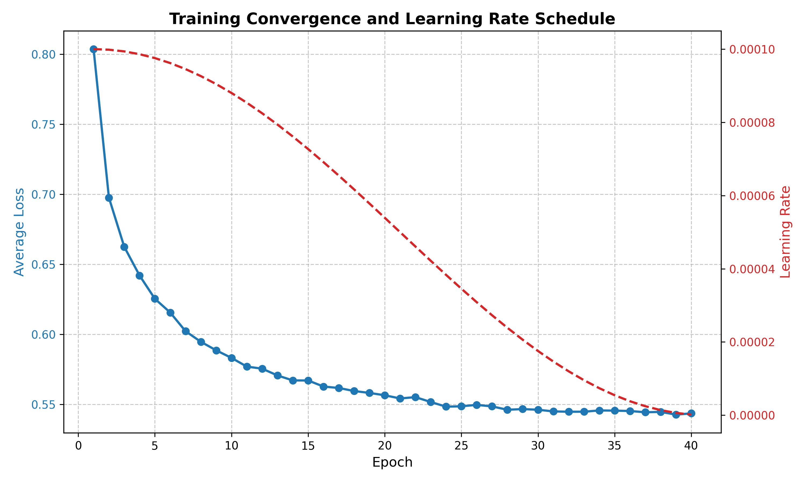
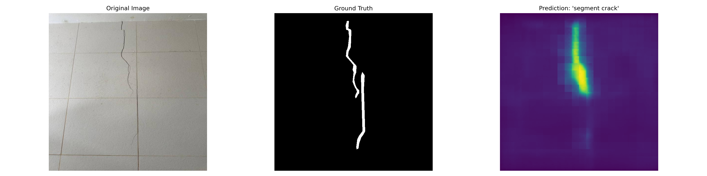

# Prompted Segmentation for Drywall & Cracks
[](https://www.python.org/)
[](https://pytorch.org/)
[](https://github.com/huggingface/peft)

This repository contains a text-conditioned segmentation system designed for automated quality assurance in construction. By utilizing a **CLIPSeg** architecture augmented with **Low-Rank Adaptation (LoRA)**, the model can dynamically identify structural cracks and drywall taping joints through natural language prompts.


## Features

* **Prompt-Driven Segmentation:** Single model capable of switching tasks via text (e.g., *"segment crack"* vs *"segment taping area"*).
* **Parameter Efficient:** Leverages LoRA to reduce trainable parameters from **159M** to just **995K** (~0.6% footprint).
* **High Sensitivity:** Demonstrates significant performance gains when using context-specific prompts.
* **Unified Pipeline:** Handles inconsistent source data (polygons vs. bounding boxes) through a custom mask generation pipeline.

---
## Training Progress
The model was trained over 40 epochs with a Cosine Annealing scheduler, showing stable convergence and effective adaptation to the industrial domain.


---
## Setup Instructions

### 1. Clone the Repository
```bash
git clone https://github.com/VivekNarula7/prompted_segmentation_for_cracks_and_drywall.git
cd prompted_segmentation_for_cracks_and_drywall
   
```
### 2. Create Conda Environment

It is recommended to use a dedicated Conda environment to avoid dependency conflicts.

```bash
conda create -n drywall-segmentation python=3.13 -y
conda activate drywall-segmentation

```

### 3. Install Dependencies

Install all required libraries, including PyTorch, Hugging Face Transformers, and PEFT, using `pip`.

```bash
pip install -r requirements.txt

```

*Note: Ensure you have the appropriate CUDA drivers installed if using an NVIDIA GPU.*

### 4. Model Checkpoints

Due to GitHub's file size restrictions, the models are distributed as follows:

| Model Version | Location | Size |
| :--- | :--- | :--- |
| **Joint LoRA Adapter** | `data/joint_lora_clipseg` | ~4 MB |
| **Full Fine-Tuned Model** | [Download from Google Drive](https://drive.google.com/drive/folders/18H6P17yPCs1P3YK2LGWwBdtp0HQnJ-ng?usp=sharing) | ~600 MB |

### How to use the Full Fine-Tuned Model:
1. Download the `fine_tuned_clipseg_cracks` folder from the link above.
2. Place the folder inside the `data/` directory of this repository.
3. Ensure the structure looks like this: `data/fine_tuned_clipseg_cracks`.

### 5. Quick Verification
Verify the installation by running a zero-shot evaluation on the base CLIPSeg model:
```bash
python evalute.py --model base --dataset cracks_val
```
---

## Directory Structure

```text
├── data/               # Model checkpoints (LoRA adapters & fine-tuned weights)
├── assets/             # Supplementary project files
├── models/             # Core model loading logic
├── utils/              # Metric calculations and mask processing
├── evalute.py          # Unified evaluation script with CLI arguments
├── train.py            # Training script for Joint LoRA fine-tuning
└── requirements.txt    # Project dependencies

```

---

## Running Evaluation

The `evalute.py` script is a unified tool that allows you to test different model versions across various dataset splits with automated threshold sweeping.

### Commands

| Task | Command |
| --- | --- |
| **Full Evaluation (All models)** | `python evalute.py --model all --dataset cracks_test` |
| **Evaluate LoRA Model** | `python evalute.py --model lora --dataset taping_val` |
| **Evaluate Base CLIPSeg** | `python evalute.py --model base --dataset cracks_val` |
| **Evaluate Full Fine-Tuned** | `python evalute.py --model full --dataset cracks_test` |

### Arguments

* `--model`: Choose from `base`, `lora`, `full`, or `all`.
* `--dataset`: Choose from `cracks_test`, `cracks_val`, `taping_val`, or `taping_train`.

---

## Performance Highlights

| Method | Params | Task Scope | mIoU | Mean Dice |
| --- | --- | --- | --- | --- |
| Full Fine-Tuning | ~159M | Single Task | 0.5295 | 0.6838 |
| **Joint LoRA (Ours)** | **0.99M** | **Joint Task** | **0.4676** | **0.6207** |

The Joint LoRA model is particularly effective with specific context; using the prompt `"segment wall crack"` achieved a test mIoU of **0.6851**, outperforming the full fine-tuning baseline.

---

## Qualitative Results

The model generates high-fidelity probability heatmaps that align closely with actual structural anomalies. Conditioning on specific prompts like "segment wall crack" allows the model to leverage linguistic-visual priors for better localized confidence.


---
## Project Report

For a detailed technical breakdown of the methodology and experimental setup please refer to the full project report: [Report](./assets/Report.pdf)

---
## References

* **CLIPSeg:** [Image Segmentation Using Text and Image Prompts](https://arxiv.org/abs/2112.10003) 


* **LoRA:** [Low-Rank Adaptation of Large Language Models](https://arxiv.org/abs/2106.09685) 

---
